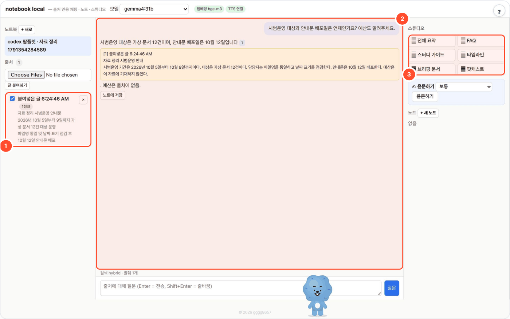
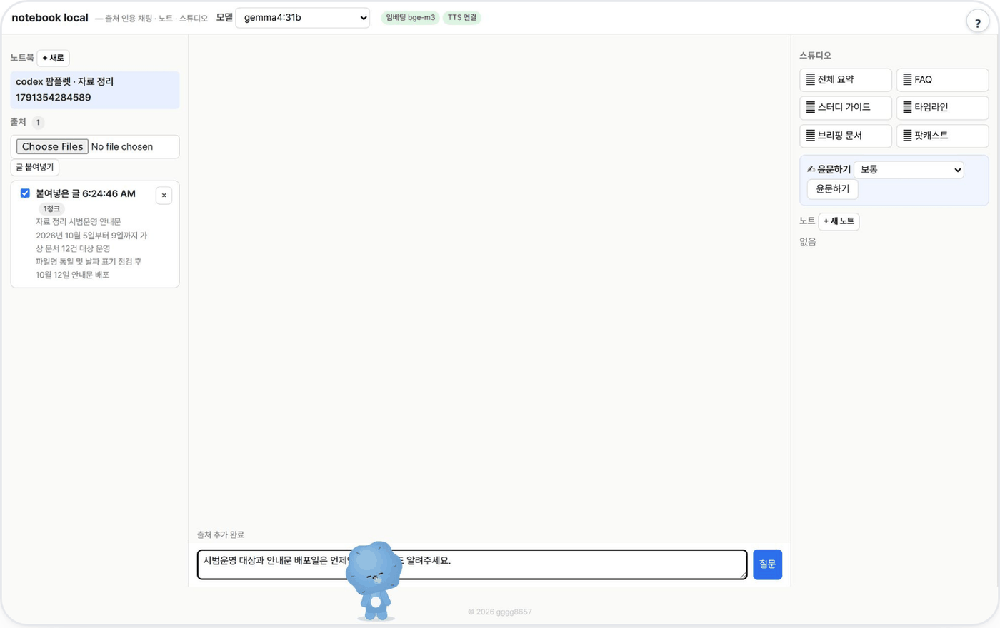

# notebook-local — 출처를 묻고 노트로 남기기

문서를 노트북에 모아 두고, 질문에 맞는 발췌를 찾아 **출처 번호 `[1]`을 달아** 답하는 로컬 LLM 노트북입니다(Google NotebookLM을 폐쇄망용으로 가볍게 다시 만든 것). 인용 번호를 누르면 근거 문단이 열립니다.



## 무엇을 하나

- HWP·HWPX·PDF·DOCX·XLSX·MD·TXT·이미지(OCR)를 출처로 올리거나 글을 붙여 넣으면 [kordoc](https://github.com/chrisryugj/kordoc)(MIT)으로 읽어 청크로 나눕니다.
- 검색은 BM25 + 임베딩(bge-m3 등) 하이브리드. 임베딩을 쓸 수 없으면 BM25만으로 동작합니다.
- 답을 노트로 저장하고, **스튜디오** 버튼으로 전체 요약·FAQ·스터디 가이드·타임라인·브리핑 문서·팟캐스트 대본을 만듭니다. 팟캐스트 음성은 별도 TTS 서버 연결이 필요합니다.
- 파이썬은 표준 라이브러리만(sqlite 저장). 클라우드 API·API 키 없음.

## 사용 방법

포털 경유(`http://<포털>:8700/t/notebook-local/`) 또는 단독 실행(`http://localhost:8769`) 화면에서:

1. **노트북과 출처를 만든다** — 왼쪽에서 **+ 새로** 노트북을 만들고 문서를 올리거나 **글 붙여넣기**로 텍스트를 추가합니다. 출처별 토글로 검색 범위를 고릅니다. (그림 ①)
2. **질문하고 인용을 연다** — 가운데에 질문을 입력하고, 답변의 `[1]` 같은 번호를 눌러 사용한 발췌를 읽습니다. (그림 ②)
3. **노트와 스튜디오를 활용한다** — 쓸 만한 답은 **노트에 저장**, 오른쪽 **스튜디오**에서 포함된 출처로 요약·FAQ·브리핑 등을 생성합니다. (그림 ③)

답변에 인용이 있어도 근거를 직접 읽어 확인하세요. 스튜디오는 포함된 출처 본문을 정해진 길이(`MAX_CHARS`)까지 받아 생성합니다.

## 예시

가상 자료를 **글 붙여넣기**로 출처에 넣고 `gemma4:31b`로 실제 질문한 결과입니다(검색 hybrid, 인용 1개).

출처:

```text
자료 정리 시범운영 안내
시범운영 기간은 2026년 10월 5일부터 10월 9일까지이다. 대상은 가상 문서 12건이다. 담당자는 파일명을 통일하고 날짜 표기를 점검한다. 안내문은 10월 12일 배포한다. 예산은 이 자료에 기재하지 않았다.
```

질문 → 답변:

```text
Q. 시범운영 대상과 안내문 배포일은 언제인가요? 예산도 알려주세요.
A. 시범운영 대상은 가상 문서 12건이며, 안내문 배포일은 10월 12일입니다 [1]. 예산은 출처에 없음.
```

<details><summary>입력 화면</summary>



</details>

## 실행

```bash
bash setup.sh                     # OS → Python → Node·kordoc → LLM 탐색 → 임베딩 모델 → selftest → http://localhost:8769
bash setup.sh stop
npm install && python3 selftest.py && python3 app.py                       # 수동
LLM_API=openai LLM_BASE_URL=http://gpu:8000/v1 LLM_MODEL=Qwen3-32B EMBED_MODEL=bge-m3 python3 app.py
python3 app.py --cli add 노트북 문서.hwpx
python3 app.py --cli ask 노트북 "예산은 얼마인가"
python3 app.py --cli studio 노트북 podcast
```

| 환경변수 | 기본 | 설명 |
|---|---|---|
| `LLM_API` | `ollama` | `ollama` 또는 `openai` |
| `LLM_BASE_URL` | `http://localhost:11434` / `http://localhost:8000/v1` | LLM 서버 |
| `LLM_MODEL` | `qwen3:8b` | 답변 모델 (UI 에서 변경 가능) |
| `LLM_API_KEY` | (없음) | OpenAI 호환 서버 키 |
| `EMBED_MODEL` | `bge-m3` | 임베딩 모델 (Ollama `/api/embed` 또는 `/v1/embeddings`). 실패하면 BM25 전용 |
| `TTS_BASE_URL` | (없음) | OpenAI 호환 `/v1/audio/speech` 서버 (예 `http://localhost:8771/v1`). 있으면 팟캐스트 mp3 생성 |
| `TTS_MODEL` / `TTS_VOICE` | `melo` / `KR` | TTS 모델·목소리 ([tts-local](https://github.com/gggg8657/tts-local) MeloTTS 한국어 기준) |
| `TTS_VOICE_A` / `TTS_VOICE_B` | `TTS_VOICE` 값 | 진행자 A/B 목소리 (화자를 여럿 지원하는 서버일 때만 다르게) |
| `TOP_K` / `MAX_CHARS` / `NUM_CTX` | `8` / `20000` / `16384` | 검색 발췌 수 / 스튜디오 입력 상한 / Ollama 컨텍스트 |
| `PORT` | `8769` | |
| `KORDOC_OFFLINE` | (없음) | `1` 이면 kordoc 아웃바운드 차단 (폐쇄망 권장) |
| `KORDOC_URL` | `http://localhost:8766` | ✍ 윤문하기가 부르는 kordoc-local 주소 |
| `WORKSPACE` | `./_workspace` | 데이터 저장 위치 (포털이 `_data/notebook-local` 로 지정) |

[agent-page-portal](https://github.com/gggg8657/agent-page-portal)에서 띄우면 `PORT`·`WORKSPACE`를 포털이 정하고, LLM 설정은 포털 프로세스의 환경변수를 물려받습니다. 현재 운영 기본값은 로컬 Ollama의 `gemma4:31b`입니다. 단독 실행 시 코드 기본값은 `qwen3:8b`입니다.

## 파이프라인

```
출처 추가  kordoc parse(문서→MD) → 청크(헤딩 breadcrumb, ~800자, 겹침 100) → 임베딩 or BM25 → sqlite → 3줄 요약(LLM 1콜)
질문      BM25 + 코사인 → RRF 융합 상위 8 → [n] 번호 붙여 LLM 1콜 → 인용 달린 답(스트리밍) → 노트 저장
스튜디오  포함된 출처 본문(상한 MAX_CHARS) → LLM 1콜 → 노트 저장. 팟캐스트는 A/B 대본 → (TTS 서버) 줄별 합성 → ffmpeg 연결 → mp3
```

데이터는 `$WORKSPACE`(기본 `_workspace/`) 아래 `notebook.db` 와 `<노트북>/<출처>/source.md`, 오디오는 `<노트북>/audio/`.

## 폐쇄망 반입

```bash
./pack.sh linux-x64            # node_modules(kordoc)+OCR 모델+스크립트 → dist-offline/notebook-local-linux-x64.tar.gz
WITH_NODE=1 ./pack.sh          # Node 바이너리까지
```

서버에서 `KORDOC_OFFLINE=1 LLM_BASE_URL=http://<gpu>:11434 bash setup.sh`. 임베딩 모델(`bge-m3`, 1.2GB)은 서버 Ollama 에 미리 반입하거나 없으면 BM25 로 동작.
`selftest.py` 는 LLM·임베딩 없이 청크·검색·인용·노트·kordoc 파싱을 검증하므로 반입 직후 점검용.

## 파일

`app.py` 서버+파이프라인 · `ui.html` · `goal-prompt.md` 역할 프롬프트(요약·채팅·스튜디오 6종) · `selftest.py` · `setup.sh` · `pack.sh` · `package.json`(kordoc ^4.17). 출처·라이선스는 `NOTICE`.

### ✍ 윤문하기
노트 편집 창·스튜디오 결과 아래에 "윤문하기" 막대(가볍게·보통·적극). kordoc-local 의 글 윤문 API(`KORDOC_URL`, 기본 `http://localhost:8766`)를 부르며, kordoc 이 안 떠 있으면 막대가 숨는다. 숫자·날짜·고유 표기가 바뀐 곳은 원문 유지, "바뀐 곳 보기"로 어절 단위 비교.

## 출처·감사 (Credits)

- [kordoc](https://github.com/chrisryugj/kordoc) (MIT, chrisryugj) — 문서 파싱·OCR (npm 에서 수정 없이 설치, `LICENSE-kordoc`)
- 기획 참고: Google NotebookLM (코드 공유 없음). 임베딩(예: [BAAI/bge-m3](https://huggingface.co/BAAI/bge-m3), MIT)·TTS 서버(기본 설정은 [tts-local](https://github.com/gggg8657/tts-local)의 MeloTTS, 또는 Kokoro(Apache-2.0) 등 OpenAI 호환)는 환경변수로 연결하는 외부 서비스
- **LLM 실행** — OpenAI 호환 API 로 호출합니다(모델 가중치는 동봉하지 않음). 기본 배포는 [Ollama](https://github.com/ollama/ollama) (MIT) 위의 Google [Gemma](https://ai.google.dev/gemma) `gemma4:31b` — 모델 이용 조건은 Gemma 배포처 참고.
- 이 도구는 [agent-page-portal](https://github.com/gggg8657/agent-page-portal) 에 연결해 쓰도록 만들었습니다(단독 실행도 됨).

저작권 표기·전체 목록은 `NOTICE` 를 보세요.

## 라이선스

[MIT License](LICENSE) — kordoc © chrisryugj(`LICENSE-kordoc`), 이 패키지에서 작성한 파일 © gggg8657.
